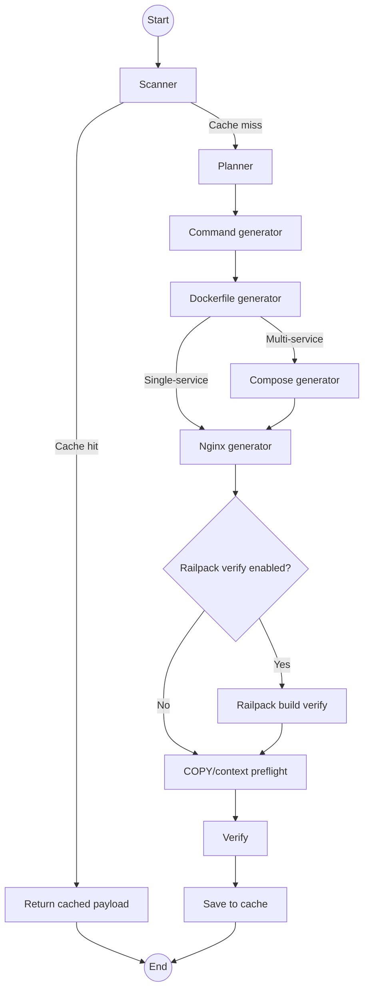

# SD-Artifacts Repo Analyzer

SD-Artifacts is a FastAPI service that analyzes GitHub repositories and generates deployment artifacts for the detected app services. The analysis pipeline scans repository structure, plans deployable services, generates Dockerfile output, optionally emits `docker-compose.yml`, builds an `nginx.conf`, and runs a verification pass with risk notes and confidence scoring.

The project is built around a LangGraph workflow and supports both one-shot JSON responses and streaming Server-Sent Events for long-running analysis and feedback remediation.

## What It Does

- Scans public or private GitHub repositories.
- Detects deployable services, stack tokens, and likely ports.
- Generates Dockerfiles per service.
- Generates `docker-compose.yml` only when multiple app services need orchestration.
- Generates an `nginx.conf` for reverse proxying and route handling.
- Verifies output with hadolint plus deterministic risk and confidence checks.
- Optionally runs a Railpack build verification pass (`SD_RAILPACK_VERIFY_ENABLED=true`) to validate buildability.
- Caches analysis results in Supabase by `repo_url + commit_sha + package_path + service_name`.
- Supports feedback-driven regeneration against an existing cached analysis.
- Supports example-bank retrieval and Dockerfile template management in Supabase.

## Pipeline



## Requirements

- Python 3.10+
- A GitHub token for private repositories or higher rate limits
- Amazon Bedrock credentials and model access
- Supabase project credentials if you want cache, example bank, benchmarks, or templates
- `hadolint` installed locally if you want Dockerfile lint output during verification

## Setup

1. Create a virtual environment and install dependencies.

```bash
python -m venv venv
# Windows
venv\Scripts\activate
# macOS/Linux
# source venv/bin/activate
pip install -r requirements.txt
```

2. Install `hadolint`.

- macOS: `brew install hadolint`
- Windows: `scoop install hadolint`
- Other platforms: download from the official GitHub releases page

3. Create a `.env` file in the project root.

```env
AWS_ACCESS_KEY_ID=your_aws_access_key
AWS_SECRET_ACCESS_KEY=your_aws_secret_key
AWS_DEFAULT_REGION=your_aws_region
BEDROCK_MODEL_ID=us.anthropic.claude-haiku-4-5-20251001-v1:0

SUPABASE_URL=your_supabase_project_url
SUPABASE_SERVICE_ROLE_KEY=your_supabase_service_role_key

API_BEARER_TOKEN=your_api_token
# Any one of these auth vars works:
# SD_API_BEARER_TOKEN=your_api_token
# API_AUTH_TOKEN=your_api_token

PORT=8080
```

4. Start the API.

```bash
python app.py
```

Alternative:

```bash
uvicorn app:app --host 0.0.0.0 --port 8080
```

## Authentication and Cache Behavior

Most mutating or live-compute endpoints require a bearer token header:

```text
Authorization: Bearer <your token>
```

`POST /analyze` and `POST /analyze/stream` have one special case:

- If the request includes `commit_sha` and a matching cached result exists, the response can be served without authentication.
- If the cache lookup misses, the request falls back to live analysis and therefore requires authentication.

This lets clients fetch known cached analyses cheaply while still protecting the expensive GitHub + LLM path.

## Core Request Fields

The main analysis request supports:

- `repo_url`: GitHub repository URL.
- `github_token`: optional token for private repos or higher API limits.
- `max_files`: scan cap, default `50`.
- `package_path`: optional monorepo subpath, default `.`.
- `service_name`: optional selector for a single service inside the analyzed scope.
- `commit_sha`: optional cache key for cache-only retrieval.

`package_path` and `service_name` are especially useful for monorepos, where you may want to analyze one package or one deployable service instead of the whole repository.

### Scope Guard for Large Monorepos

When a request targets root scope (`package_path = "."`) without `service_name`, the scanner can reject overly broad repositories and ask clients to narrow scope.

- Trigger defaults:
  - `tree_entry_count > 3000`, or
  - `candidate_package_count > 20`
- Response: `400` with structured `detail`:
  - `code = "scope_required"`
  - `reason`
  - `suggested_package_paths`
  - `suggested_service_names`

Configure via env vars:

- `SD_SCOPE_GUARD_ENABLED` (default: `true`)
- `SD_SCOPE_GUARD_TREE_THRESHOLD` (default: `3000`)
- `SD_SCOPE_GUARD_PACKAGE_THRESHOLD` (default: `20`)
- `SD_FETCH_MARKDOWN` (default: `false`) to keep live scans focused on deploy-relevant files.
- `SD_RAILPACK_VERIFY_ENABLED` (default: `false`) to run post-generation Railpack build verification.
- `SD_RAILPACK_VERIFY_TIMEOUT_SECONDS` (default: `300`) timeout for the verification build.
- `SD_RAILPACK_VERIFY_MAX_LOG_CHARS` (default: `8000`) max captured log excerpt in API response.
- `SD_PREFLIGHT_STRICT` (default: `true`) fail-fast when static Dockerfile/context preflight finds issues.

Each service now carries a deterministic build contract:
- `dockerfile_path`: which Dockerfile to use
- `build_context`: context path passed to `docker build`
- `execution_root`: where to run the command (currently always repo root `"."`)

## API Overview

Main analysis and remediation:

- `POST /analyze`
- `POST /analyze/stream`
- `POST /feedback`
- `POST /feedback/stream`

Example bank operations:

- `POST /examples/seed`
- `POST /examples/seed/popular`
- `POST /examples/preview`

Cache operations:

- `DELETE /cache`

Response outcome operations:

- `POST /responses/status` (updates pass/fail status for a `response_id`; when `passed=false`, matching cache entry is deleted)

Template operations:

- `GET /templates`
- `POST /templates`
- `POST /templates/seed`
- `DELETE /templates/{name}`

## Response Shape

The primary analysis endpoints return:

- `response_id`: unique identifier for this analysis
- `commit_sha`: git commit SHA of the analyzed code
- `stack_tokens`: list of detected technology tokens (e.g., `["node", "react", "python"]`)
- `files`: array of generated deployment artifacts (see format below)
- `risks`: list of identified risks and hadolint warnings
- `confidence`: confidence score (0.0 to 1.0) for the generated artifacts
- `token_usage`: token counts for LLM calls (`input_tokens`, `output_tokens`, `total_tokens`)

### File Artifact Format

Each file in the `files` array contains:

```json
{
  "name": "Dockerfile",
  "content": "...",
  "location": "apps/dashboard/Dockerfile"
}
```

**Fields:**
- `name`: filename (e.g., `Dockerfile`, `docker-compose.yml`, `nginx.conf`)
- `content`: full file content (ready to write to disk)
- `location`: full file path where the file should be placed in the repo
  - Dockerfiles: specific to their service location (e.g., `backend/Dockerfile`, `apps/web/Dockerfile`)
  - docker-compose.yml: root-level (`docker-compose.yml`)
  - nginx.conf: fixed location (`/etc/nginx/conf.d/nginx.conf`)

**Example response:**

```json
{
  "response_id": "abc123",
  "commit_sha": "def456",
  "stack_tokens": ["node", "react"],
  "files": [
    {
      "name": "Dockerfile",
      "content": "FROM node:20-alpine\nWORKDIR /app\n...",
      "location": "Dockerfile"
    },
    {
      "name": "docker-compose.yml",
      "content": "version: '3.8'\nservices:\n...",
      "location": "docker-compose.yml"
    },
    {
      "name": "nginx.conf",
      "content": "upstream web { server localhost:3000; }\n...",
      "location": "/etc/nginx/conf.d/nginx.conf"
    }
  ],
  "risks": [
    "hadolint (Dockerfile): DL3018 Pin versions in apt-get install",
    "Base image is not pinned to a specific version"
  ],
  "confidence": 0.92,
  "token_usage": {
    "input_tokens": 2500,
    "output_tokens": 1200,
    "total_tokens": 3700
  }
}
```

Streaming endpoints emit `progress`, `complete`, and `error` events as SSE.

## Example Workflows

Analyze a repo:

```bash
curl -X POST http://localhost:8080/analyze \
  -H "Authorization: Bearer $API_BEARER_TOKEN" \
  -H "Content-Type: application/json" \
  -d '{
    "repo_url": "https://github.com/user/repo-name",
    "package_path": "."
  }'
```

Stream progress:

```bash
curl -N -X POST http://localhost:8080/analyze/stream \
  -H "Authorization: Bearer $API_BEARER_TOKEN" \
  -H "Content-Type: application/json" \
  -d '{
    "repo_url": "https://github.com/user/repo-name"
  }'
```

Iterate on an existing cached analysis:

```bash
curl -X POST http://localhost:8080/feedback \
  -H "Authorization: Bearer $API_BEARER_TOKEN" \
  -H "Content-Type: application/json" \
  -d '{
    "repo_url": "https://github.com/user/repo-name",
    "commit_sha": "abc123def456",
    "feedback": "The API service should expose the correct health check and nginx should route /api to the backend."
  }'
```

## Benchmarking

The benchmark runner evaluates:

- scanner and planner quality against labeled repositories
- checked-in artifact quality for Dockerfile, compose, and nginx files
- optionally generated-artifact quality when `--include-generated` is enabled

Run the standard benchmark:

```bash
python tools/evaluate_scan_quality.py \
  --labels-file benchmarks/example_bank_labels.json \
  --max-workers 2
```

Run generated-artifact evaluation:

```bash
python tools/evaluate_scan_quality.py \
  --labels-file benchmarks/example_bank_labels.json \
  --max-workers 2 \
  --include-generated
```

Latest snapshot from [`benchmarks/latest-scan-quality.json`](/C:/Users/aniru/OneDrive/Desktop/own/sd-artifacts/benchmarks/latest-scan-quality.json):

- Run ID: `20260407-020210`
- Generated at: `2026-04-07T02:02:10.661596+00:00`
- Targets evaluated: `18`
- Service precision/recall/F1: `0.9545 / 0.8750 / 0.9130`
- Mobile leakage rate: `0.0`
- Stack accuracy: `1.0`
- Known-port accuracy: `0.8333` (`20/24`)
- Port unknown rate: `0.0417`
- Failure buckets: `ok = 16`, `port_mismatch = 1`, `service_recall_miss = 1`
- Checked-in artifact summary:
- Dockerfile avg/pass-rate: `0.6179 / 0.2857`
- Compose avg/pass-rate: `0.8167 / 0.6667`
- Nginx avg/pass-rate: `0.1611 / 0.0`
- Combined avg/all-present-pass-rate: `0.5953 / 0.2`

See [docs/quality-and-testing.md](/C:/Users/aniru/OneDrive/Desktop/own/sd-artifacts/docs/quality-and-testing.md) for metrics, thresholds, and output details.

## Testing

Run the test suite:

```bash
python -m pytest tests -q
```

Run the benchmark-focused regression subset:

```bash
python -m pytest tests/test_node_retry_integration.py tests/test_evaluate_scan_quality.py -q
```

## Project Layout

- [`app.py`](/C:/Users/aniru/OneDrive/Desktop/own/sd-artifacts/app.py): FastAPI entrypoint and public endpoints
- [`graph/`](/C:/Users/aniru/OneDrive/Desktop/own/sd-artifacts/graph): LangGraph workflows and node logic
- [`tools/`](/C:/Users/aniru/OneDrive/Desktop/own/sd-artifacts/tools): helpers for examples, evaluation, templates, and metrics
- [`tests/`](/C:/Users/aniru/OneDrive/Desktop/own/sd-artifacts/tests): unit and integration-style tests
- [`docs/`](/C:/Users/aniru/OneDrive/Desktop/own/sd-artifacts/docs): API and operational documentation
- [`benchmarks/`](/C:/Users/aniru/OneDrive/Desktop/own/sd-artifacts/benchmarks): labels, reports, and stack-token references

## Documentation Index

- [API examples](/C:/Users/aniru/OneDrive/Desktop/own/sd-artifacts/docs/api-examples.md)
- [Feedback remediation flow](/C:/Users/aniru/OneDrive/Desktop/own/sd-artifacts/docs/feedback-workflow.md)
- [Retry and timeout strategy](/C:/Users/aniru/OneDrive/Desktop/own/sd-artifacts/docs/retry-timeout-strategy.md)
- [Quality metrics and testing](/C:/Users/aniru/OneDrive/Desktop/own/sd-artifacts/docs/quality-and-testing.md)
- [Stack token reference](/C:/Users/aniru/OneDrive/Desktop/own/sd-artifacts/benchmarks/stack_tokens.md)

## Tech Stack

- FastAPI
- LangGraph and LangChain
- Amazon Bedrock
- GitHub API
- Supabase

## License

MIT
